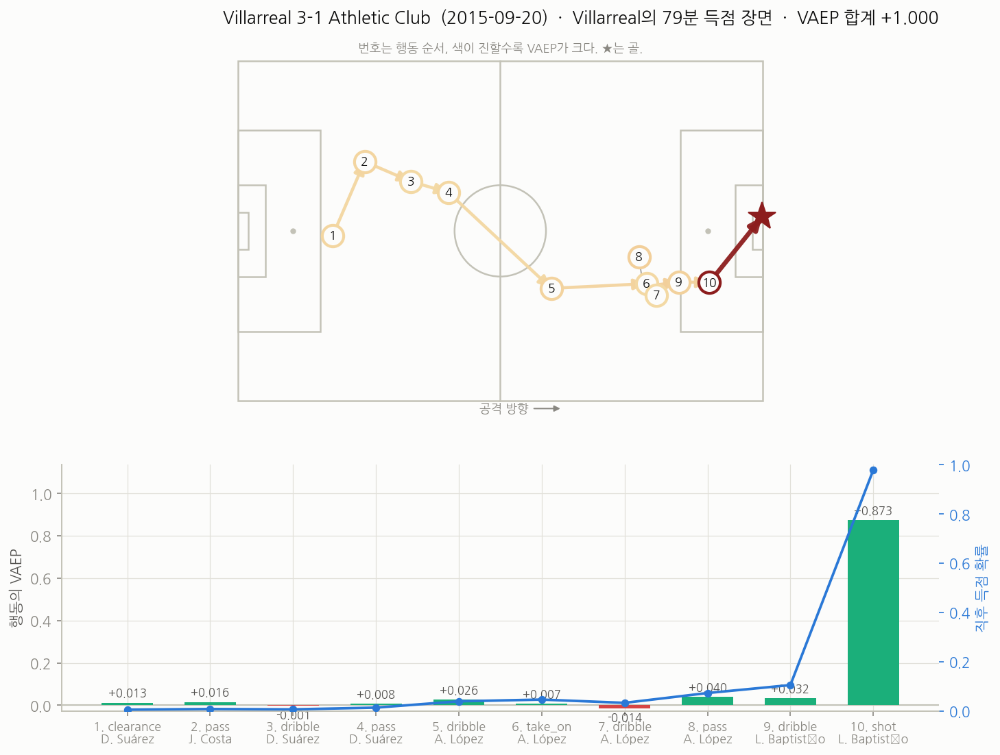
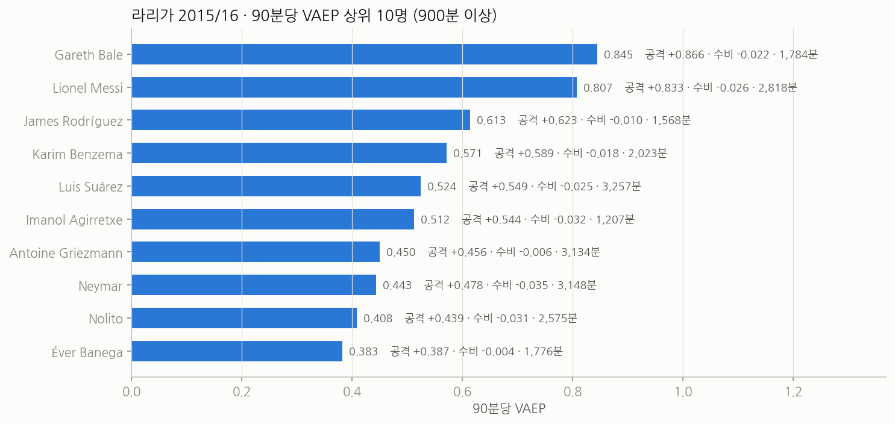

# 라리가 2015/16 VAEP

패스 하나, 드리블 하나에 점수를 매긴다. 그 행동으로 우리 팀이 곧 골을 넣을 확률이 얼마나 올랐고
먹을 확률이 얼마나 내렸는지를 더한 값이 VAEP다. 골과 어시스트만 세면 보이지 않던 기여가 드러난다.

StatsBomb이 공개한 **라리가 2015/16 380경기**로 [socceraction](https://github.com/ML-KULeuven/socceraction)의
VAEP 파이프라인을 처음부터 끝까지 다시 돌린 기록이다. 원본 이벤트 → SPADL 행동 757,309개 →
게임 상태 피처 145개 → 득점·실점 확률 모델 → 행동별 가치 → 선수 랭킹 순으로 간다.

과정과 결과는 **[`vaep.ipynb`](vaep.ipynb)** 한 권에 다 들어 있다(출력까지 저장해 뒀으니 열기만 하면 된다).
원본 다운로드부터 전부 다시 돌리는 데 **약 3분**이면 된다 — `python run_all.py`.

### 한 번의 공격을 행동 단위로 쪼개면



셀타 비고가 자기 진영에서 태클로 공을 끊어 10개 행동 만에 득점하는 동안, 득점 확률이 0.5%에서 골까지 어떻게 올라가는지와
그 상승분이 누구 몫인지를 보여준다. 위는 경기장 위의 행동 흐름, 아래는 행동별 VAEP(막대)와 직후 득점 확률(선)이다.

### 시즌 전체로 모으면



선수가 한 모든 행동의 VAEP를 더해 출전 시간으로 나눈 값이다. 이 값들은 모두 **그 경기를 학습에 쓰지 않은 모델**의
예측에서 나온다.

## 현재 결과

2026년 9월 19일 기준.

### 득점·실점 확률 모델

`scores`는 어떤 행동 뒤 10개 행동 안에 공을 가진 팀이 골을 넣었는가, `concedes`는 먹었는가다.
각각 100번에 1번, 400번에 1번 일어나는 드문 일이라 정확도는 의미가 없다.
확률의 크기가 맞는지(Brier, log loss)와 순서를 잘 매기는지(ROC AUC)로 본다.
**Brier skill**은 '항상 평균값만 찍는 모델' 대비 개선율이고, AUC 구간은 경기를 다시 뽑는 부트스트랩 500번으로 구했다.

| 평가 방식 | 대상 | 기저율 | Brier | Brier skill | log loss | ROC AUC (95% 구간) |
|---|---|---|---|---|---|---|
| OOF (경기 단위 5겹, 380경기) | 득점 | 1.10% | 0.00927 | 0.150 | 0.0476 | **0.819** (0.812 ~ 0.827) |
|  | 실점 | 0.24% | 0.00226 | 0.036 | 0.0146 | **0.767** (0.747 ~ 0.785) |
| 홀드아웃 (마지막 76경기) | 득점 | 1.11% | 0.00932 | 0.149 | 0.0481 | **0.813** (0.791 ~ 0.834) |
|  | 실점 | 0.22% | 0.00211 | 0.043 | 0.0135 | **0.782** (0.737 ~ 0.831) |

교차검증과 홀드아웃이 거의 같다. 시즌 앞 304경기만 보고 뒤 76경기를 예측해도 성능이 떨어지지 않는다.
캘리브레이션 곡선(`figures/model_eval.png`)도 대각선에 붙어 있어, 모델이 말하는 "5%"는 실제로 5%다.

실점 모델이 득점 모델보다 눈에 띄게 약하다. 공을 가진 팀이 곧 실점하는 일은 400번에 한 번이라
사건 수가 1,782개뿐이고, 그 일이 일어나는 이유(상대의 역습 능력, 수비 위치)는 온더볼 이벤트에 거의 남지 않는다.

### 90분당 VAEP 상위 10명

900분(약 10경기) 이상 뛴 343명 중에서.

| # | 선수 | 팀 | 경기 | 출전(분) | 공격/90 | 수비/90 | **VAEP/90** |
|---|---|---|---|---|---|---|---|
| 1 | Gareth Bale | Real Madrid | 23 | 1,784 | 0.866 | -0.022 | **0.845** |
| 2 | Lionel Messi | Barcelona | 33 | 2,818 | 0.833 | -0.026 | **0.807** |
| 3 | James Rodríguez | Real Madrid | 26 | 1,568 | 0.623 | -0.010 | **0.613** |
| 4 | Karim Benzema | Real Madrid | 27 | 2,023 | 0.589 | -0.018 | **0.571** |
| 5 | Luis Suárez | Barcelona | 35 | 3,257 | 0.549 | -0.025 | **0.524** |
| 6 | Imanol Agirretxe | Real Sociedad | 16 | 1,207 | 0.544 | -0.032 | **0.512** |
| 7 | Antoine Griezmann | Atlético Madrid | 38 | 3,134 | 0.456 | -0.006 | **0.450** |
| 8 | Neymar | Barcelona | 34 | 3,148 | 0.478 | -0.035 | **0.443** |
| 9 | Nolito | Celta Vigo | 29 | 2,575 | 0.439 | -0.031 | **0.408** |
| 10 | Éver Banega | Sevilla | 25 | 1,776 | 0.387 | -0.004 | **0.383** |

값은 모두 **그 경기를 학습에 쓰지 않은 모델**의 예측에서 나온다. 자기 경기를 외운 모델이 준 점수가 아니다.

### 한 번의 공격

`figures/sequence.png`는 골로 끝난 공격 하나를 행동 단위로 쪼갠 것이다.
셀타 비고가 자기 진영에서 태클로 공을 끊어 10개 행동 만에 득점하는 동안,
득점 확률이 0.5% → 3.9% → 7.3% → 10.5% → 골로 올라간다.
가장 크게 올린 사람은 마무리한 놀리토(+0.873)와 그에게 마지막 패스를 준 오레야나(+0.032)다.
처음 공을 끊은 태클(+0.013, 대부분 수비 가치)에도 점수가 붙는다 — VAEP가 수비 행동에 값을 주는 방식이다.

## 재현 방법

### 1. 환경

Python 3.11.13에서 테스트했다 (3.9 ~ 3.12면 된다).

```
cd vaep
python -m venv .venv
.venv/bin/pip install -r requirements.txt      # Windows는 .venv\Scripts\pip
```

SPADL 변환과 VAEP 공식은 socceraction 패키지를 그대로 쓴다. `requirements.txt`는 PyPI의 1.5.3을 받는다.
저장소를 직접 받아 둔 게 있으면 `pip install -e ../socceraction`으로 대신해도 된다.

**GPU는 있으면 쓰고 없으면 안 쓴다.** `src/train.py`가 `nvidia-smi`로 가장 한가한 GPU를 찾아
xgboost에 넘기고, 실패하면 CPU로 돌아간다. 학습 단계가 GPU에서 100초 남짓, CPU에서 3분쯤이다.
CPU로 강제하려면 `VAEP_DEVICE=cpu`를 환경변수로 준다.

xgboost 스레드는 16개로 제한한다(`src/train.py`의 `N_THREADS`). 코어가 많은 기계에서 전부 쓰면
경합 때문에 오히려 느려진다 — 80스레드에서 폴드당 15분 걸리던 것이 16스레드에서 30초였다.

### 2. 데이터

따로 받을 필요 없다. 첫 실행 때 `src/fetch_statsbomb.py`가
[StatsBomb Open Data](https://github.com/statsbomb/open-data)에서 라리가 2015/16 380경기를
`data/statsbomb/`로 받는다 (1.1GB, 약 1분). open-data 저장소와 같은 폴더 구조로 저장하므로
socceraction의 `StatsBombLoader(getter="local")`가 그대로 읽는다. 이미 받은 파일은 건너뛴다.

```
data/statsbomb/competitions.json
              /matches/11/27.json          # competition 11 = 라리가, season 27 = 2015/16
              /events/{match_id}.json      # 380개
              /lineups/{match_id}.json     # 380개
```

### 3. 실행

`vaep.ipynb`를 열고 모두 실행하면 된다. 맨 위 0번 셀이 데이터 준비부터 학습·평가·그림까지 다시 계산하고,
나머지 셀이 그 결과로 표와 그림을 만든다. 이미 계산된 결과만 보려면 0번 셀의 `RUN_PIPELINE`을 `False`로 바꾼다.

VS Code에서는 오른쪽 위 커널 선택에서 `.venv`를 고른다.

터미널에서 돌려도 결과는 같다.

```
python run_all.py                 # 전체 (1~6단계)
python run_all.py --list          # 단계 목록
python run_all.py --from train    # 4단계부터 이어서
python run_all.py --only value    # 5단계만
python run_all.py -q              # 각 단계의 마지막 줄만
```

### 4. 결과가 같은지

난수 시드를 고정했고(`src/config.py`의 `SEED`), 경기 정렬은 같은 날짜면 `game_id` 순으로 타이브레이크까지 고정했다.
전체 파이프라인을 두 번 돌려 `out/actions.parquet`, `features.parquet`, `predictions.parquet`의 md5가
모두 같은 것을 확인했다. 학습을 다른 GPU에서 돌려도 같았다.

여기까지 오는 데 걸림돌이 하나 있었다. **socceraction 1.5.3에는 위치가 없는 이벤트의 좌표가
초기화되지 않은 메모리 값으로 남는 버그가 있다** (`spadl/statsbomb.py`의 `_convert_locations`가
`np.empty`로 배열을 잡고 위치가 있는 이벤트만 채운다). 그대로 두면 행동 757,309개 중 일곱 개의 좌표가
실행마다 달라지고, 그 일곱 줄 때문에 모델과 선수 순위가 매번 바뀐다.
`src/build_spadl.py`의 `patch_missing_locations()`가 그 행을 NaN으로 채워 막는다.

다만 **폴드를 다르게 나누면 선수 값은 움직인다.** 시드를 바꿔 5겹을 세 번 다시 나눠 봤더니
상위 12명의 90분당 VAEP가 중앙값 0.019(최대 0.037)만큼 흔들렸고,
상위 10명의 순위 변동은 최대 1계단이었다. 1·2위(베일, 메시)는 세 번 모두 그대로였다.
표의 소수 셋째 자리를 그대로 믿을 것은 못 된다.

## 파이프라인

| 단계 | 스크립트 | 하는 일 | 걸린 시간 |
|---|---|---|---|
| fetch | `src/fetch_statsbomb.py` | StatsBomb 원본 380경기 다운로드 (있으면 건너뜀) | 47초 (두 번째부터 0초) |
| spadl | `src/build_spadl.py` | 원본 이벤트 → SPADL 행동 757,309개 | 20~40초 |
| features | `src/build_features.py` | 게임 상태 피처 145개와 라벨 2개 | 10~15초 |
| train | `src/train.py` | 득점·실점 확률 모델 학습·평가 (OOF + 홀드아웃) | 100~200초 (GPU) |
| value | `src/value.py` | VAEP 공식 적용, 선수 랭킹 | 7~10초 |
| viz | `src/viz.py` | 공격 장면의 VAEP 변화 그림 | 7~11초 |

원본을 이미 받아 둔 상태에서 전체가 3~8분이었다 (RTX A6000 한 장, 공용 서버라 부하에 따라 폭이 있다).

기본 파이프라인 밖에 있는 분석 스크립트도 있다. 본문에 인용한 비교 실험과 민감도 측정이 이들에서 나온다.

```
python src/ablation.py            # 피처·알고리즘·용량 비교      (약 20분)
python src/fold_sensitivity.py    # 폴드 재분할 민감도            (약 8분)
python src/compare_traditional.py # 골·어시스트 순위와 비교        (약 1분)
python src/report_figures.py      # 보고서용 흑백 그림
python src/make_report.py         # 보고서 문서 생성 (상위 폴더에 저장)
```

`src/config.py`에 경로·시드·모델 설정이, `src/style.py`에 그림 스타일이 모여 있다.
중간 산출물은 전부 `out/`에 parquet/csv로 떨어진다.

| 파일 | 내용 |
|---|---|
| `out/actions.parquet` | SPADL 행동 757,309개 |
| `out/features.parquet`, `labels.parquet` | 모델 입력 145열과 라벨 2열 |
| `out/predictions.parquet` | OOF 득점·실점 확률 (VAEP 계산에 쓰는 것) |
| `out/predictions_holdout.parquet` | 홀드아웃 76경기 예측 |
| `out/action_values.parquet` | 행동별 공격 가치·수비 가치·VAEP |
| `out/player_ratings.csv` | 선수별 합계와 90분당 값 |
| `out/metrics.csv`, `feature_importance.csv`, `value_by_actiontype.csv`, `sequence.csv` | 표로 쓰는 요약 |

## 폴더 구조

```
vaep/
├── README.md                  이 문서
├── requirements.txt           고정된 패키지 버전
├── run_all.py                 파이프라인 실행기
├── vaep.ipynb                 결과를 순서대로 보여주는 노트북 (출력 포함)
├── src/
│   ├── config.py              경로·시드·모델 설정 (여기만 고치면 전체에 반영)
│   ├── fetch_statsbomb.py     원본 수집
│   ├── build_spadl.py         이벤트 → SPADL (좌표 버그 우회 포함)
│   ├── build_features.py      피처 145개 + 라벨 2개
│   ├── train.py               학습·평가 (OOF + 홀드아웃, 부트스트랩 신뢰구간)
│   ├── value.py               VAEP 공식 적용, 선수 랭킹
│   ├── viz.py                 공격 장면 시각화
│   ├── style.py               그림 공통 설정
│   ├── ablation.py            피처·알고리즘·용량 비교 실험
│   ├── fold_sensitivity.py    폴드 재분할 민감도
│   ├── compare_traditional.py 골·어시스트 순위와 비교
│   ├── report_figures.py      흑백 그림 (문서용)
│   └── make_report.py         보고서 문서 생성기
├── data/statsbomb/            원본 (자동 다운로드, git 제외)
├── out/                       중간·최종 산출물 (큰 parquet은 git 제외)
└── figures/                   그림 (report/ 하위는 보고서용 흑백판)
```

## 방법

**SPADL.** 공급자마다 다른 이벤트 표기를 `<선수, 팀, 시간, 시작위치, 끝위치, 행동유형, 결과, 신체부위>`로 통일한 형식이다.
한 경기 이벤트 3천여 개가 행동 2천여 개로 줄어든다. 행동 유형은 23가지이고,
같은 선수가 공을 몰고 간 구간은 `dribble` 행동으로 따로 만들어 넣는다(그래서 드리블 수가 29만 개로 많다).

**피처.** 행동 하나만 보지 않고 **게임 상태**, 즉 지금 행동(a0)과 직전 두 행동(a1, a2)을 함께 본다.
같은 위치의 패스라도 직전에 무슨 일이 있었는지에 따라 값이 달라야 하기 때문이다.
위치·유형·결과·신체부위·골대까지의 거리와 각도·직전 행동과의 시간·현재 스코어 등 145열이 나온다.
공격 방향은 모두 왼쪽 → 오른쪽으로 맞춘 뒤 계산한다.

**라벨.** 각 행동 시점에서 앞으로 10개 행동 안에 공을 가진 팀이 득점하면 `scores=1`, 실점하면 `concedes=1`.

**값.** 공격 가치 = 행동 후 득점 확률 − 행동 전 득점 확률, 수비 가치 = −(행동 후 실점 확률 − 행동 전 실점 확률),
VAEP = 둘의 합. 직전 행동이 상대 팀 것이면 상대의 확률을 뒤집어 비교하고, 직전 행동이 10초보다 오래 전이면
새 국면으로 보고 0에서 시작한다. 페널티킥(0.792)과 코너킥(0.047)의 직전 확률은 VAEP 논문의 고정값을 쓴다.

**평가.**

- 경기 단위 5겹 교차검증으로 380경기 전부에 대해 그 경기를 학습에 쓰지 않은 예측(OOF)을 만든다.
  4~6절의 VAEP 값과 선수 랭킹은 모두 이 예측에서 나온다.
- 날짜순 앞 80%(304경기)로 학습해 마지막 76경기(2016-04-02 이후)를 한 번만 예측하는 홀드아웃을 따로 둔다.
- AUC 95% 구간은 경기를 다시 뽑는 부트스트랩 500번으로 구한다.
- 모델은 XGBoost 100트리 · 깊이 3 (`src/config.py`의 `XGB_PARAMS`). 득점용과 실점용을 따로 학습한다.
  트리 수와 깊이는 `src/ablation.py`의 용량 비교(50/3, 100/3, 200/4, 300/6을 같은 5겹 OOF로)에서 고른 값이다.
  양성이 1%뿐이라 큰 모델은 과적합한다 — 300/6은 실점 AUC 0.737, 100/3은 0.767이었다.

## 한계

- **공에 닿은 행동만 값을 받는다.** 공간을 만드는 움직임, 수비 위치잡기, 골키퍼 선방 대부분은 이벤트 데이터에
  남지 않아 0점이다. 상위권이 공격수로 채워지는 것도 이 때문이다.
- **수비 가치는 구조적으로 작다.** 실점 확률의 기저율이 0.24%라 그 변화폭도 작다. 위 표에서 수비/90이
  음수인 선수가 많은 것은 수비를 못해서가 아니라, 공을 가지고 위험을 감수하는 행동이 많기 때문이다.
- **선수 값에는 폭이 있다.** 위 순위표는 한 번의 폴드 배정에서 나온 숫자다. 폴드를 다시 나누면
  90분당 값이 0.02 안팎(최대 0.04)까지 움직인다(순위 변동은 최대 1계단).
  1~2위와 '상위 10명 언저리'라는 결론은 흔들리지 않지만, 4위와 6위를 가르는 데 쓸 정밀도는 아니다.
- 10개 행동 / 10초라는 구간 설정과 페널티·코너 고정 확률은 VAEP 논문 값을 그대로 썼다. 다르게 잡으면 값도 달라진다.
- 한 리그 한 시즌이다. 리그가 다르면 확률 모델도 다시 학습해야 한다.

## 데이터 출처와 라이선스

- 데이터: [StatsBomb Open Data](https://github.com/statsbomb/open-data) — 사용 조건은 해당 저장소의 라이선스를 따른다.
- 코드: [socceraction](https://github.com/ML-KULeuven/socceraction) (MIT).
- 방법: Tom Decroos, Lotte Bransen, Jan Van Haaren, Jesse Davis.
  *Actions speak louder than goals: Valuing player actions in soccer.* KDD 2019.
